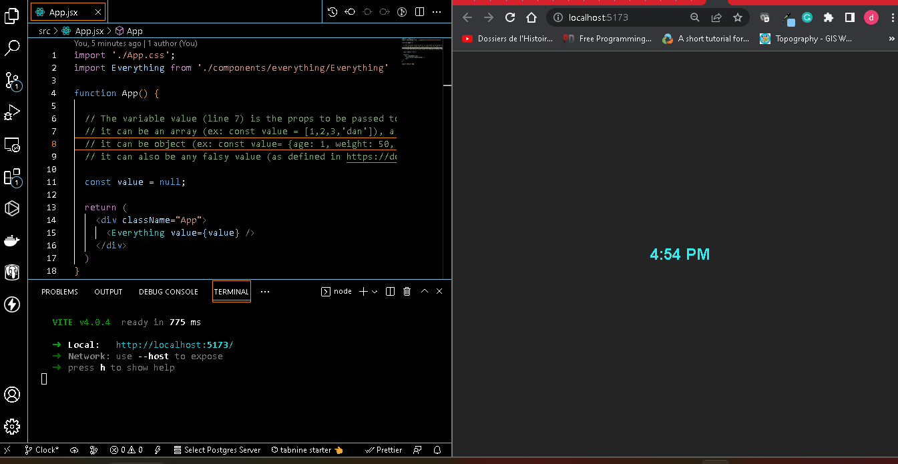

# Everything

## Table of Contents

- [Everything](#everything)
  - [Table of Contents](#table-of-contents)
  - [Presentation animation](#presentation-animation)
  - [Description](#description)
  - [Built With](#built-with)
  - [Getting Started](#getting-started)
    - [Prerequisites](#prerequisites)
    - [Setup](#setup)
  - [Scripts](#scripts)
    - [Start dev server](#start-dev-server)
    - [Build for production](#build-for-production)
  - [Connect With Us](#connect-with-us)
  - [Show your support](#show-your-support)
  - [License](#license)

## Presentation animation

## Description

Display-everything is an app that contains a component named Everything that accepts an "input" prop. If the "input" prop is falsy, render a live-updating date and time that updates every second. If the "input" prop is an array, render the array's elements in a list. If the "input" prop is anything else, render the value in.

The variable input (line 7 in App.jsx) is the props to be passed to the everything component.
  it can be an array (ex: const value = [1,2,3,'dan']), a string or a number.
  it can be object (ex: const value= {age: 1, weight: 50, name: 'Dan'}).
  it can also be any falsy value (as defined in https://developer.mozilla.org/en-US/docs/Glossary/Falsy)
 

## Built With

- [React](https://create-react-app.dev/)
- [Vite](https://vitejs.dev/)

## Getting Started

To get a local copy up and running follow these simple following steps.

### Prerequisites

- Node Js
- Code editor
- Git 

### Setup

1. Clone this project by typing in your terminal `git clone https://github.com/david-lafontant/display-everything.git` .
2. Go to the directory with `cd display-everything`
3. Open you favorite code editor ( Vs Code user have to type `code .`)
4. Type `npm i` to download all the dependencies and enjoy!

## Scripts

### Start dev server

- `npm run dev` open the browser at `http://localhost:5173`

### Build for production

- `npm run build`

## Connect With Us

👤 **David**

Platform | Badge |
 --- | --- |
 **GitHub**  | [@david-lafontant](https://github.com/david-lafontant)
 **Twitter** | [@manikatex](https://twitter.com/manikatex)
 **LinkedIn** | [David Lafontant](https://www.linkedin.com/in/david-lafontant/)

## Show your support

Give a ⭐️ if you like this project!

## License

This project is [MIT](MIT.md) licensed.

